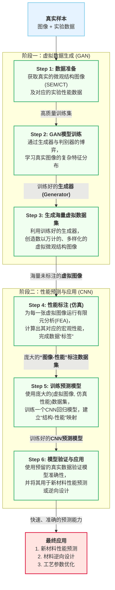

```mermaid
%% 定义图表为从上到下的流程图 (Top to Down)
graph TD

    %% 定义样式
    classDef data fill:#e6f3ff,stroke:#87ceeb,stroke-width:2px;
    classDef process fill:#f0fff0,stroke:#3cb371,stroke-width:2px;
    classDef model_output fill:#fff8dc,stroke:#ffdead,stroke-width:2px;
    classDef final_app fill:#ffe4e1,stroke:#dc143c,stroke-width:2px;

    %% 阶段一：基于GAN的虚拟数据生成
    subgraph "阶段一：虚拟数据生成 (GAN)"
        A["<b>Step 1: 数据准备</b><br>获取真实的微观结构图像(SEM/CT)<br>及对应的实验性能数据"]:::process
        B["<b>Step 2: GAN模型训练</b><br>通过生成器与判别器的博弈，<br>学习真实图像的复杂特征分布"]:::process
        C["<b>Step 3: 生成海量虚拟数据集</b><br>利用训练好的生成器，<br>创造数以万计的、多样化的虚拟微观结构图像"]:::process
    end

    %% 阶段二：基于CNN的性能预测
    subgraph "阶段二：性能预测与应用 (CNN)"
        D["<b>Step 4: 性能标注 (仿真)</b><br>为每一张虚拟图像运行有限元分析(FEA)，<br>计算出其对应的宏观性能，完成数据“标签”"]:::process
        E["<b>Step 5: 训练预测模型</b><br>使用庞大的(虚拟图像, 仿真性能)数据集，<br>训练一个CNN回归模型，建立“结构-性能”映射"]:::process
        F["<b>Step 6: 模型验证与应用</b><br>使用预留的真实数据验证模型准确性，<br>并将其用于新材料性能预测或逆向设计"]:::process
    end

    %% 定义数据流和连接
    RealData["<br><b>真实样本</b><br>图像 + 实验数据<br>"]:::data --> A
    A -->|"高质量训练集"| B
    B -->|"训练好的<b>生成器 (Generator)</b>"| C
    C -->|"海量未标注的<b>虚拟图像</b>"| D
    D -->|"庞大的<b>“图像-性能”标注数据集</b>"| E
    E -->|"训练好的<b>CNN预测模型</b>"| F
    F -->|"快速、准确的预测能力"| FinalOutput["<b>最终应用</b><br>1. 新材料性能预测<br>2. 材料逆向设计<br>3. 工艺参数优化"]:::final_app
```
